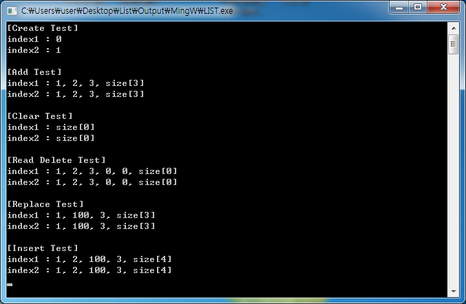

# 게임메이커용 연결 리스트

게임메이커의 `ds_list` 처럼 쓸 수 있게 C++ 로 만든 이중 연결 리스트 모듈이다. 게임메이커가 외부 DLL 과 주고받을 수 있는 값은 double 과 문자열뿐이라, 리스트 핸들도 저장하는 값도 전부 double 로 두었다. 리스트를 만들면 번호를 돌려주고 그 번호로 골라서 조작하는 식이라 `ds_list` 와 쓰는 법이 같다. 리스트 모듈과 그 동작을 검증하는 콘솔 테스트로 구성된다.

<p>
  
</p>


## 사용 방법

Releases에서 받은 테스트 프로그램을 실행하면 생성, 추가, 비우기, 읽고 삭제, 교체, 삽입 순으로 두 리스트를 오가며 검증한 결과가 출력된다. 소스는 `LIST.dev` 를 wxDev-C++ 로 열거나 `Makefile.win` 으로 빌드한다.

`list.h` 의 함수는 이렇게 쓴다.

```cpp
double a = list_create();        // 리스트를 만들고 번호를 받는다
list_set_index(a);               // 이후 호출이 적용될 리스트를 고른다
list_data_add(1); list_data_add(2); list_data_add(3);

list_data_set_read_pos(1);       // 읽기 위치를 두 번째 값으로
list_data_insert(100);           // 읽기 위치 뒤에 끼워 넣는다: 1, 2, 100, 3
list_data_get_data();            // 읽기 위치의 값을 돌려주고 한 칸 앞으로
list_destroy();                  // 고른 리스트를 통째로 지운다
```


## 구현 원리

**리스트의 리스트다.** 리스트 하나(`LIST`)가 값 노드(`DATA`)의 이중 연결 리스트를 갖고, 리스트들 자체도 이중 연결 리스트로 이어진다. 둘 다 마지막 노드의 `next` 가 첫 노드를 가리키는 원형이고, 첫 노드의 `back` 은 자기 자신을 가리킨다. `list_create` 는 새 `LIST` 를 고리 끝에 붙이고 증가하는 번호를 매겨 돌려준다. `list_set_index` 는 고리를 돌면서 번호가 맞는 리스트를 찾아 현재 리스트로 잡는다.

```cpp
typedef struct _LIST {
    struct _LIST *next, *back;      // 리스트끼리의 연결
    struct _DATA *first, *last;     // 이 리스트의 값 노드
    double index;
    double size;
} LIST;
```

**현재 리스트와 읽기 커서로 상태를 유지한다.** 함수마다 리스트 번호를 넘기지 않고 `list_set_index` 로 고른 리스트에 이후 호출이 적용된다. 그 안에서 읽기 커서 하나를 두고 `list_data_get_data` 는 커서 값을 돌려준 뒤 한 칸 전진하고, 삭제와 교체와 삽입은 커서 자리에서 일어난다. 커서가 끝을 지나면 원형이라 처음으로 돌아온다.

**값은 전부 double 이다.** 게임메이커의 `external_define` 이 double 과 문자열만 주고받기 때문에 핸들, 크기, 위치, 저장값을 모두 double 로 맞춰 나중에 DLL 로 바로 옮길 수 있게 했다.


## 파일

| 경로 | 내용 |
|---|---|
| `source/list.h`, `source/list.cpp` | 연결 리스트 모듈 |
| `source/main.cpp` | 콘솔 테스트 |
| `source/LIST.dev`, `source/Makefile.win` | wxDev-C++ 프로젝트와 MinGW 메이크파일 |
| `docs/screenshots/` | 스크린샷 |
| Releases | 콘솔 테스트 프로그램 |


## 라이선스

zlib 라이선스다. 자세한 내용은 [LICENSE](LICENSE) 에 있다.
